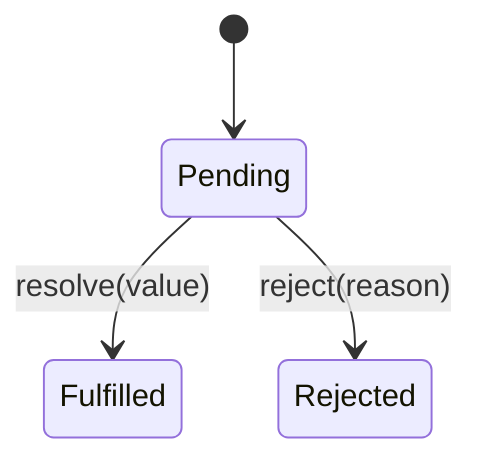
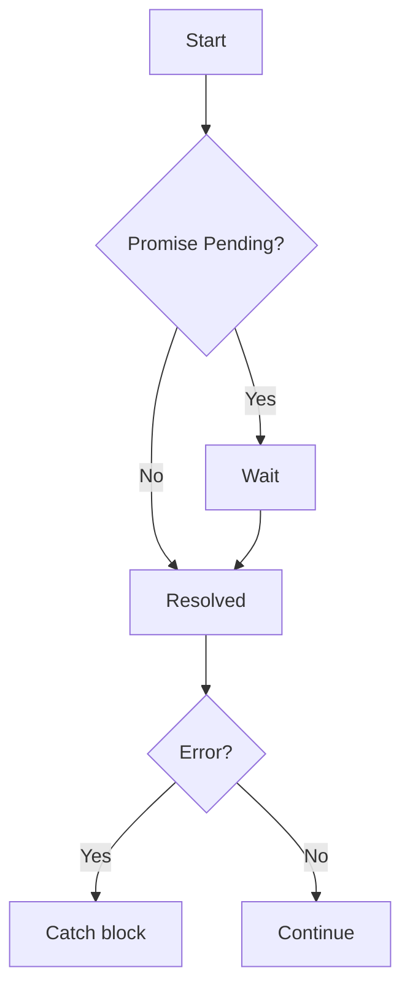
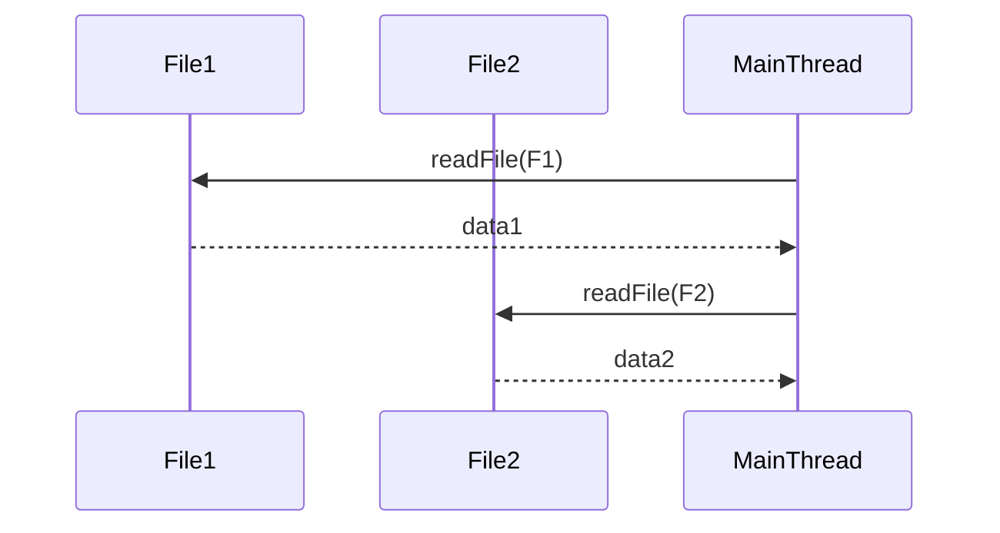
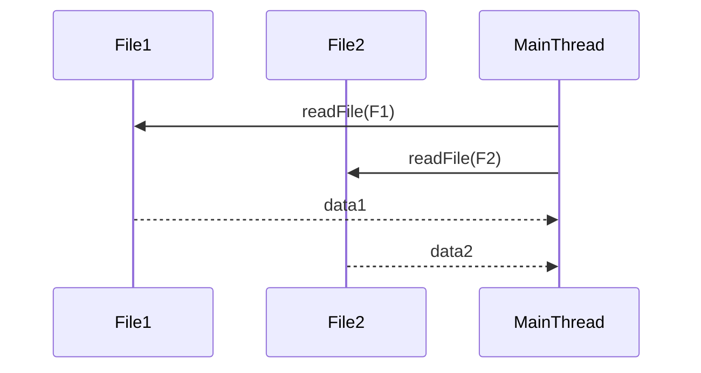

### JavaScript Promises & Async/Await — Complete Reference

# Table of Contents
1. Introduction
2. What is a Promise?
3. Promise States
4. Creating and Using Promises
5. Async/Await
6. Error Handling
7. Loops and Async
8. Sequential vs Parallel Execution
9. Promise Utilities
10. Async/Await in Express.js
11. Edge Cases & Gotchas
12. Mixing Callbacks and Promises
13. Best Practices
14. Visual Diagrams
15. Cheat Sheet
16. References

---

## Introduction
Async programming in JS allows non-blocking execution of tasks such as file I/O, HTTP requests, database operations, and timers. Modern JS uses Promises and async/await instead of callbacks.

## What is a Promise?
A Promise represents the eventual result of an async operation.

```js
const promise = new Promise((resolve, reject) => {
  setTimeout(() => {
    const success = true;
    if(success) resolve("Success!");
    else reject("Error!");
  }, 1000);
});
```

## Promise States
- Pending: Operation in progress
- Fulfilled: Operation succeeded
- Rejected: Operation failed



## Creating and Using Promises
```js
promise.then(res => console.log(res)).catch(err => console.error(err));
```
Promise chaining:
```js
fetchData()
  .then(data => processData(data))
  .then(result => console.log(result))
  .catch(err => console.error(err));
```

## Async/Await
```js
async function fetchData() {
  try {
    const result = await somePromiseFunction();
    console.log(result);
  } catch(err) {
    console.error(err);
  }
}
```

## Error Handling
```js
try {
  const res = await promise;
} catch(err) {
  console.error(err);
}
```

## Loops and Async
### for...of (sequential)
```js
for(const file of files){
  const content = await fs.promises.readFile(file, 'utf-8');
}
```
### forEach (does NOT wait)
```js
files.forEach(async file => {
  const content = await fs.promises.readFile(file, 'utf-8');
});
```

## Sequential vs Parallel Execution
Sequential:
```js
for(const file of files){
  await fs.promises.readFile(file, 'utf-8');
}
```
Parallel:
```js
await Promise.all(files.map(f => fs.promises.readFile(f, 'utf-8')));
```
With error handling:
```js
const results = await Promise.allSettled(files.map(f => fs.promises.readFile(f, 'utf-8')));
results.forEach(r => console.log(r.status, r.value || r.reason));
```

## Promise Utilities
- Promise.all([...])
- Promise.allSettled([...])
- Promise.race([...])
- Promise.any([...])
- Promise.resolve(value)
- Promise.reject(reason)

## Async/Await in Express.js
```js
app.get('/', async (req, res) => {
  try {
    const data = await fs.promises.readFile('data.txt', 'utf-8');
    res.send(data);
  } catch(err) {
    res.status(500).send(err.message);
  }
});
```

## Edge Cases & Gotchas
1. await in forEach ignored
2. Sequential vs parallel execution
3. Promise.all fails if one rejects
4. Async functions always return Promises
5. Top-level await only in ESM
6. Mixing callbacks with async can fail silently

## Mixing Callbacks and Promises
```js
// Bad
fs.readFile('file.txt', async (err, data) => {
  const result = await asyncFunc(data); // might fail silently
});

// Good
const data = await fs.promises.readFile('file.txt','utf-8');
const result = await asyncFunc(data);
```

## Best Practices
1. Use Promises + async/await over callbacks
2. Wrap async code in try/catch
3. Use for...of for sequential operations
4. Use Promise.all/allSettled for parallel
5. Only one res.send per Express route
6. Handle rejected Promises
7. Convert callbacks to Promises if needed

## Visual Diagrams
### Async Flow


### Sequential vs Parallel
Sequential:

Parallel:


## Cheat Sheet
| Pattern | Example | Notes |
|---------|---------|------|
| Sequential | for...of + await | Each iteration waits |
| Parallel | Promise.all([...]) | Runs concurrently |
| Parallel with errors | Promise.allSettled([...]) | Individual error handling |
| Express | async (req,res)=>{try{await}catch(err){res.status(500)}} | Safe pattern |
| Top-level await | await fs.promises.readFile(...) | Only in ESM |
| Returning values | async ()=>value | Always returns Promise |
| Mixing callbacks | Avoid inside async | Use fs.promises |

## References
- [MDN: Promises](https://developer.mozilla.org/en-US/docs/Web/JavaScript/Reference/Global_Objects/Promise)
- [MDN: async/await](https://developer.mozilla.org/en-US/docs/Learn/JavaScript/Asynchronous/Promises#async_await)
- [Node.js fs.promises](https://nodejs.org/api/fs.html#fspromisesreadfilepath-options)
- [Promise.allSettled](https://developer.mozilla.org/en-US/docs/Web/JavaScript/Reference/Global_Objects/Promise/allSettled)
- [JavaScript.info: Async](https://javascript.info/async)

---
End of Notes.

