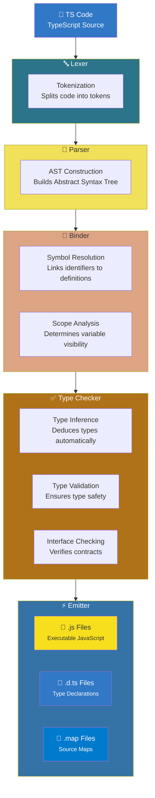

# TypeScript Compilation Pipeline (Detailed)

When you write **TypeScript code**, it does not run directly. It goes through several stages before becoming JavaScript that the browser or Node.js can execute.

---

## **1. Lexer (Tokenizer)**

- **Purpose:** Breaks TS code into **tokens** (keywords, operators, identifiers, literals).
- **Example:**

```ts
let x: number = 5;
```


Tokens: let | x | : | number | = | 5 | ;

**Why it matters:** All compilers (TS, C/C++, Java) need this first step to understand code structure.

## 2. Parser

**Purpose:** Converts tokens into an Abstract Syntax Tree (AST).

**AST** = tree representation of code structure.

Example AST nodes for above code:

VariableDeclaration

**Identifier:** x

**Type:** number

**Initializer:** 5

**Comparison:**

TS → builds AST for further type checking

C/C++/Java → also build AST internally (part of compilation)

## 3. Binder

**Purpose:** Resolves names, scopes, and symbols (variables, functions, classes).

Creates a symbol table.

**Example:** In let x = 5; let y = x + 10; → Binder connects x used in y to its declaration.

Unique to TS: Exposed in compiler steps because JS normally has no static binding.

**Comparison:**

C/C++/Java → Conceptually similar (symbol table exists) but always strict, so developers don’t notice a separate step.

## 4. Type Checker

**Purpose:** Ensures types are correct before runtime.

**Example:**

let x: number = "hello"; // ❌ Error!

**TS vs other languages:**

TS → gradual and optional, can mix JS code

C/C++ → strict compile-time type checking

Java → strict compile-time type checking

## 5. Emitter

**Purpose:** Generates final files that can be executed or used.

**Outputs:**

.js → Compiled JavaScript (runs in browser/Node)

.d.ts → Type declaration files (like C++ header files, for type info in libraries)

.map → Source map (maps compiled JS back to original TS for debugging)

**Comparison:**

C → emits object files (.o) or executables

Java → emits bytecode (.class) for JVM


# TypeScript Compilation Flow Diagram

```text
# TypeScript Compilation Pipeline




## Output Files

| File Type           | Purpose                            | Target Environment |
| ------------------- | ---------------------------------- | ------------------ |
| **`.js`**   | Executable JavaScript code         | Browser / Node.js  |
| **`.d.ts`** | Type declarations for IntelliSense | Development tools  |
| **`.map`**  | Source maps for debugging          | Debuggers          |

## Key Stages

1. **Lexer** - Converts source code into tokens
2. **Parser** - Builds Abstract Syntax Tree (AST) from tokens
3. **Binder** - Creates symbol tables and resolves scopes
4. **Type Checker** - Validates type safety and inferences
5. **Emitter** - Generates final output files

Quick Comparison: TypeScript vs C/C++/Java

| Stage        | TypeScript              | C/C++                     | Java                      |
| ------------ | ----------------------- | ------------------------- | ------------------------- |
| Lexer        | ✅ Yes                  | ✅ Yes                    | ✅ Yes                    |
| Parser       | ✅ Yes                  | ✅ Yes                    | ✅ Yes                    |
| Binder       | ✅ Yes (explicit in TS) | Conceptual (symbol table) | Conceptual (symbol table) |
| Type Checker | ✅ Yes, gradual/static  | ✅ Yes, strict            | ✅ Yes, strict            |
| Emitter      | .js, .d.ts, .map        | .o/.obj, executable       | .class bytecode           |

## Key Takeaways

TS = JavaScript + type system + compilation steps

Binder + Type Checker = extra safety for JS projects

C/C++/Java already enforce types, so binder/checker are built-in and strict

.d.ts files in TS = like header files in C/C++, letting other TS code know types without source

.map = helps debugging TS → JS
